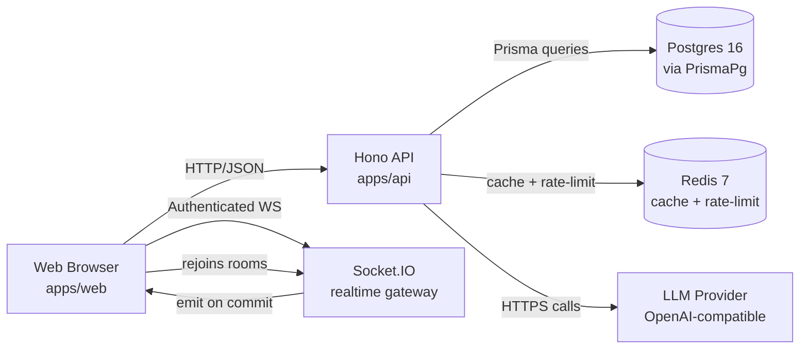
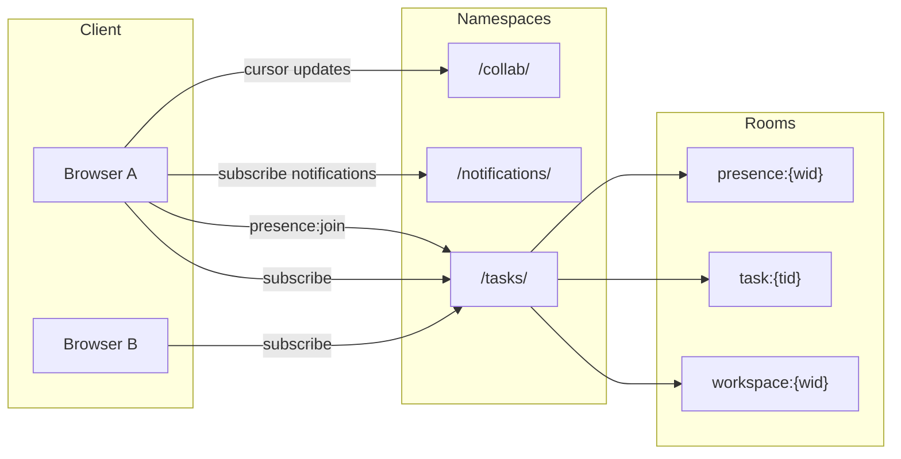

# FlowDesk Architecture

Read once before touching modules. For onboarding, see `docs/DEV.md`. For product context, see `PRD.md`. Decisions are recorded in `ADR-*.md`. Operating rules: `AGENTS.md`. Risks: `RISKS.md`.

## System Overview



Two-way flow: every successful write on `Api` emits a socket event; subscribed browsers patch local state. No polling; no fire-and-forget broadcasts (R-31 mitigation).

## Backend Module Anatomy

Every domain follows:

```
apps/api/src/modules/{feature}/
  {feature}.routes.ts      # Hono router + zValidator + per-route rate limit
  {feature}.service.ts     # business logic; orchestrates repo + cache + sockets
  {feature}.repository.ts  # Prisma only; no logic
  {feature}.schema.ts      # Zod schemas for I/O validation
  {feature}.types.ts       # TS types/interfaces (not in @flowdesk/shared)
  {feature}.test.ts        # colocated unit tests (where useful)
```

Rules:

- Routes only wire HTTP. No Prisma, no `assertMembership` (use middleware).
- Services own all logic. They call repos, cache, and sockets; they emit only after a successful commit.
- Repos are thin. They translate Zod-validated input → Prisma queries and return raw rows.
- Schemas are reused on the FE (`packages/shared`). Do not duplicate types drift.

Cross-cutting layer (`apps/api/src/shared/`):

```
apps/api/src/shared/
  middleware/
    auth.ts              # verify httpOnly JWT cookie → attach ctx.user
    rate-limit.ts        # Redis sliding-window; reads policy from rate-limit-policies.ts
    error-handler.ts     # maps typed errors → JSON { code, message }; logs 5xx
    request-id.ts        # injects X-Request-ID header for tracing

  lib/
    prisma.ts            # singleton PrismaClient with prisma-extension applied
    prisma-extension.ts  # soft-delete middleware + query logging
    redis.ts             # singleton ioredis client; used by cache + rate-limit + presence
    jwt.ts               # sign / verify access & refresh tokens (RS256)
    socket.ts            # Socket.IO server init + connection auth middleware
    llm-provider.ts      # OpenAI-compatible fetch wrapper; 30s timeout, 1 retry
    logger.ts            # pino logger; JSON in prod, pretty in dev
    rate-limit-policies.ts  # named policy map (auth:login, ai:*, writes:*)

  errors/
    index.ts             # barrel: AppError, NotFoundError, ForbiddenError, LLMError, …
```

Middleware composition order (see `ADR-006-security-middleware-pattern.md`):

```
requestId → logger → errorHandler → auth → assertMembership → rateLimiter → routeHandler
```

> **Rule:** nothing in `apps/api/src/modules/` imports from `shared/lib/` directly except via the service layer. Routes import middleware; services import lib singletons. This keeps unit tests fast — stub the lib, not the HTTP layer.

## Frontend Feature Anatomy

```
apps/web/src/features/{feature}/
  components/              # feature UI
  hooks/                   # TanStack Query wrappers
  api.ts                   # type-safe client (Zod-validated)
  types.ts                 # feature types
  index.ts                 # public surface (only file imported elsewhere)
```

Cross-cutting:

- `apps/web/src/components/ui/` — primitives from shadcn/ui (dialog, dropdown, popover, tooltip, kanban, …).
- `apps/web/src/lib/` — shared clients: `api`, `queryClient`, `socket`, `auth`, `utils`.
- `apps/web/src/pages/` — route-level shells, mostly composition.

Mutations should use optimistic updates where UX demands it (`TanStack Query`). No raw `useEffect` fetches; the `api.ts` client already enforces Zod on response bodies.

## End-to-End Flows

### Login

1. `apps/web/src/features/auth/LoginForm.tsx` posts to `/api/auth/login` with email + password.
2. `apps/api/src/modules/auth/auth.routes.ts` validates via `bcrypt` (cost 10).
3. Service issues access + refresh JWT (`apps/api/src/shared/lib/jwt.ts`), writes them as `httpOnly` cookies.
4. Client navigates to `/`. Subsequent API calls carry the cookie automatically.

### Task Create

1. Client opens `NewTaskModal` → on submit, calls `apps/web/src/features/task/api.ts` `createTask(...)`.
2. Handler validates against Zod → POSTs `/api/tasks`.
3. `task.routes.ts` → `zValidator('json', createTaskSchema)` → `task.service.ts#create`.
4. Service runs in a `prisma.$transaction` (Task + initial dependency + label assignments).
5. On success, emits `task:created` on `/tasks` namespace room `workspace:{workspaceId}`.
6. Subscribed clients patch their queries. Presence is unaffected.

### Drag Task across Columns

1. `Kanban` DnD handler builds `updateTaskStatus({ id, status })` mutation.
2. PATCH `/api/tasks/:id` with `{ status }` only.
3. Service repositions in Prisma and emits `task:moved`.
4. The dragged card's `:has-task-moved` flag clears on the broadcast ack.

### @mention in Comment

1. Comment composer emits `createComment({ taskId, body })` on Ctrl+Enter.
2. POST `/api/tasks/:id/comments` → service tokenizes body, finds `@username` matches in workspace members.
3. For each match: create `Notification` row + emit on `/notifications` namespace to user socket.
4. Recipient bell menu updates in real time; toast appears if focus is on the page.

### AI Assignment Suggestion

1. User clicks "AI suggest" on a task.
2. POST `/api/ai/suggest-assignment` → `ai.service.ts` loads per-member workload (`prisma.task.groupBy`) and recent activity.
3. Calls `llm-provider.ts` (configured `LLM_BASE_URL` + `LLM_MODEL`). See `ADR-002-ai-provider.md`.
4. Returns ranked list. UI renders one fallback list alongside the AI ranking; click applies via `PATCH /api/tasks/:id { assigneeId }`. Caveat: dev proxy is slow (R-24).

## Auth + Security

Reference: `ADR-003-auth-jwt-cookie.md`, `ADR-006-security-middleware-pattern.md`.

- **JWT in httpOnly cookie.** `SameSite=Lax` blocks third-party XHR. CSRF-safe for a JSON API.
- **bcrypt cost 10.** Was 12 in pre-F1 baseline; reduced for login latency budget (see `claude-progress.md` session 011/012).
- **`assertMembership(workspaceId, userId)`** middleware on every attachment, comment, task, dependency, and AI mutation. Cross-workspace → 401.
- **Rate limits (Redis sliding-window via `rate-limit.ts`):**

| Bucket          | Window | Max | Scope    |
| --------------- | ------ | --- | -------- |
| `auth:register` | 1h     | 3   | per IP   |
| `auth:login`    | 1min   | 5   | per IP   |
| `auth:refresh`  | 1min   | 30  | per IP   |
| AI routes       | 1min   | 5   | per user |
| `/api/*` writes | 1min   | 60  | per user |

Every response sets `X-RateLimit-*`; `429` includes `Retry-After`. Suite config: `apps/api/src/shared/lib/rate-limit-policies.ts`.

- **Socket auth.** Middleware on `connection` verifies the access token from the cookie or `auth.token`. Failure → `unauthorized` event + `socket.disconnect(true)`. Implementation: `apps/api/src/shared/lib/socket.ts`.

## Realtime

Reference: `ADR-004-realtime-socketio.md`.



Rules:

- Namespaces by domain (`/tasks`, `/notifications`, `/collab`).
- Rooms by resource (`workspace:{id}` for global broadcast, `task:{id}` for narrow).
- `socket.leave()` in `disconnect` to avoid room leaks.
- **Presence gateway:** `apps/api/src/modules/realtime/realtime.gateway.ts`. Backed by Redis hash `presence:{wid}`, 30s TTL, 10s sweeper. Broadcast on every change.
- Client reconnect: exponential backoff 1s → 30s, randomization 0.5, timeout 20s.

## Data Model Snapshot

Models in `packages/db/prisma/schema.prisma`. Every model carries `id` (cuid), `createdAt`, `updatedAt`. Soft-delete models (User, Workspace, Task, TaskLabel, TaskLabelAssignment, Comment) also carry `deletedAt?`. Indexes on every FK and common filter. Uniqueness constraints where business logic demands it.

- **User** — account; bcrypt password hash; optional Google `providerId`.
- **Workspace** — tenant; name + slug.
- **WorkspaceMember** — `userId × workspaceId × role` (Owner/Admin/Member/Guest). Unique.
- **Column** — workspace column with position, color, isDoneColumn flag.
- **Task** — the work item. `status`, `priority`, `assigneeId`, `createdById`, `dueDate`. Subtasks are child tasks via `parentTaskId`. Blockers/blocks in `TaskDependency`.
- **TaskDependency** — `blockingTaskId × blockedTaskId`. Unique.
- **TaskLabel** — per-workspace; `name` + named-enum `color` (8 values).
- **TaskLabelAssignment** — `task × label` join.
- **Comment** — `taskId` + `authorId` + `body`. Supports threaded replies via `parentCommentId`.
- **Notification** — `userId` + `type` (`TASK_ASSIGNED`, `TASK_MENTIONED`, …) + payload.
- **Attachment** — `taskId` + `uploadedById` + `size` + `type` + storage pointer.
- **RefreshToken** — refresh token storage for JWT rotation.
- **ChatChannel** — workspace chat channel; `name` + `isPrivate`.
- **ChatMessage** — channel message; `channelId` + `authorId` + `content`.
- **WorkspaceNotificationSetting** — per-workspace notification preferences (email toggles, digest schedule).
- **UserNotificationPreference** — per-user per-workspace notification opt-out.
- **EmailJob** — BullMQ-style email queue entry; `status`, `attempts`, `scheduledAt`.

See `packages/db/prisma/schema.prisma` for the source of truth.

## Caching

Per-resource Redis keys with explicit TTL:

- `workspace:{wid}` — 5–15 min; invalidated on workspace mutation.
- `task:{tid}` — 30s; invalidated on `task.service.ts` commit.
- `labels:{wid}` — 60s; invalidated on label service mutation.
- `presence:{wid}` — see Realtime section.

Convention: the service that mutates owns the invalidation. No global TTL bumps.

## AI Layer

- `apps/api/src/shared/lib/llm-provider.ts` — single seam. Configured by `LLM_BASE_URL`, `LLM_API_KEY`, `LLM_MODEL`.
- 30s `AbortController` timeout. 1 retry on 5xx. Errors map to `LLMError` → 502 with `code: LLM_UPSTREAM`.
- Caching off by default; let the upstream provider cache if it wants.
- See `ADR-002-ai-provider.md`.

## Build + Deploy

```bash
pnpm stack:up                 # production-like compose up
pnpm stack:up-build           # idempotent image rebuild
pnpm stack:down
pnpm stack:logs
pnpm stack:ps
```

Healthcheck: `GET /api/health` → 200. Seed: `pnpm db:seed`. Demo login: `demo@flow-desk.app` / `demo1234`.

## Sharp Edges

- **R-24 — LLM latency UX.** Local proxy provider is slow (~18–27s/call). Surface spinners; do not block the UI.
- **Prisma custom output.** `apps/api/generated/prisma/` is gitignored. Always import from there. Never publish a `@prisma/client` import in `apps/api/src/`.
- **Seed ESM/CJS.** Prisma 7 client uses `import.meta.url`. `scripts/prisma-exec.sh` builds the seed as ESM with a `require` shim banner.
- **Node 22 only.** Earlier toolchains silently fail on `view transitions` and Prisma 7 ESM.
- **pnpm 11 + monorepo Docker.** Hoist settings live in `pnpm-workspace.yaml`, not `.npmrc`. See `claude-progress.md` session 014.
- **Lefthook secret scan.** Never bypass on commits that touch code or env. Re-run with `pnpm check:secrets`.

## Cross-References

- `README.md` — install + quick start
- `docs/USER.md` — end-user guide
- `docs/DEV.md` — developer onboarding
- `PRD.md` — product requirements
- `AGENTS.md` — operating rules for coding agents
- `ADR-001-monorepo.md` → `ADR-006-security-middleware-pattern.md`
- `RISKS.md` — risk register
- `claude-progress.md` — session log
- `feature_list.json` — feature state
- `CHANGELOG.md` — public change log
