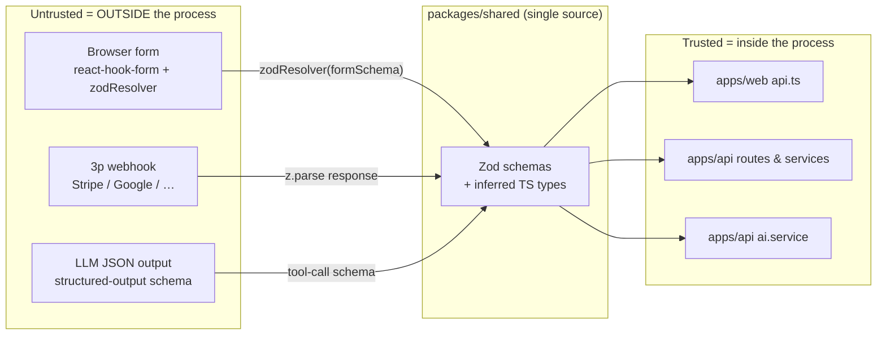
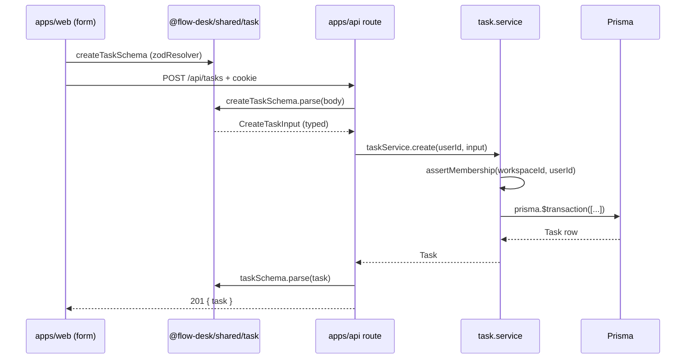

# Zod Validation Architecture

Single contract, three consumers. Schemas live in `packages/shared`, validate at every trust boundary, and produce both runtime checks and static types. No duplicate type definitions drift because there are no duplicate type definitions.

## Why Zod, Why Centralized

Decision drivers (see `ADR-002-ai-provider.md` for the parallel single-seam pattern):

- **One source of truth.** A field added to `Task.input` lands on the API validator, the FE form, and the typed API client from a single edit.
- **Runtime + types.** `z.infer<typeof schema>` gives the TS type; `schema.parse(...)` gives the runtime check. Same definition, no codegen.
- **Composability.** `.extend`, `.omit`, `.partial`, `.merge` handle schema evolution without rewriting consumers.
- **Cheap error shape.** `.flatten()` → `{ fieldErrors, formErrors }` maps cleanly onto the `400 VALIDATION_ERROR` envelope.

Alternatives rejected at architecture time:

- **io-ts** — extra runtime, weaker TS inference, no React Hook Form resolver.
- **Hand-written interfaces + manual guards** — duplication drift between FE form, FE client, BE validator. The exact failure mode we wanted to eliminate.
- **JSON Schema + codegen** — heavier toolchain, weaker composition story, two-file edit for every change.

## Package Layout

```
packages/shared/src/
  common.ts        # primitives: email, password, slug, cuid, pagination, string bounds
  pagination.ts    # CursorPaginationQuery + CursorPaginationEnvelope + encode/decode
  user.ts          # registerSchema, loginSchema, userPublicSchema, changePasswordSchema
  auth.ts          # authResponseSchema, refreshTokenSchema, oauthCallbackSchema
  workspace.ts     # workspace CRUD + member schemas
  task.ts          # createTaskSchema, updateTaskSchema, moveTaskSchema, taskSchema, ...
  comment.ts       # createCommentSchema, commentSchema, listCommentsQuerySchema
  label.ts         # label CRUD schemas
  notification.ts  # notification + list query schemas
  attachment.ts    # attachment response schemas
  index.ts         # barrel re-export (no barrel imports inside the package — see Why)
```

Build target (`tsup.config.ts`): dual ESM/CJS with per-module subpath exports (`@flow-desk/shared/task`, `@flow-desk/shared/auth`, etc.). Subpath imports keep individual module graphs small; do not glob-import from `@flow-desk/shared` from inside the package.

### Naming

- **Input schemas** — `<verb><Entity>Schema`: `createTaskSchema`, `updateTaskSchema`, `moveTaskSchema`, `registerSchema`.
- **Entity schemas** — bare `<entity>Schema`: `taskSchema`, `commentSchema`, `userPublicSchema`. Always the wire shape — never an internal DB shape.
- **Query schemas** — `list<Entity>QuerySchema` or extend `CursorPaginationQuery`.
- **Types** — `z.infer` aliases exported beside the schema with matching `Input`/`Query` suffix or bare name.

## The Two-Ring Contract



Two rings, one definition:

- **Outside ring** (untrusted): browser form input, third-party webhook payloads, LLM structured output. Each is parsed through a Zod schema before any business logic runs.
- **Inside ring** (trusted): the API service layer. Inputs crossing into the inside ring have already been parsed; the service uses the inferred TS type and never re-parses.

## Request Lifecycle (Create Task)



Validation happens **three times**, on purpose:

1. **Client form** — `zodResolver(formSchema)` for instant feedback before submit. Optional but standard for complex forms.
2. **API request** — `zValidator(...)` or inline `.parse(await c.req.json())`. Authoritative. Anything missing here is a bug, regardless of client behavior.
3. **API response** — `taskSchema.parse(task)` before serializing. Catches accidental type drift between a Prisma result and the wire contract (`apps/api/src/modules/task/task.routes.ts:34`).

Forms that are too simple for `react-hook-form` rely on the API's request-time validation only. The cost of skipping client-side parse on a one-field form is one extra round-trip; the cost of duplicating client and server schemas is drift.

## Error Pipeline

Every Zod failure hits the same path:

1. `@hono/zod-validator` calls `safeParse`. On failure the middleware short-circuits with `c.json(...)` and our `errorHandler` never sees it (see `apps/api/src/modules/workspace/workspace.routes.ts:28` for the canonical shape: `{ code: 'INVALID_QUERY', details: result.error.flatten() }`).
2. Inline `.parse(await c.req.json())` inside the handler throws `ZodError`. `errorHandler` (`apps/api/src/shared/middleware/error-handler.ts:33`) maps it to `400 { code: 'VALIDATION_ERROR', details: err.flatten(), requestId }`.
3. The web client (`apps/web/src/lib/api.ts:36`) tears `message` off `ApiError.body` and surfaces it. The `details.fieldErrors` map is available for per-field UI hints when the form needs them.

Two error shapes in the wild — both intentional:

- `INVALID_QUERY` for malformed inputs that should never reach the handler.
- `VALIDATION_ERROR` for body/param failures that the handler caught first.

The split exists because query-string failures usually mean a programmer bug (link/bookmark), body failures usually mean a user input bug.

## Canonical Patterns

### Extend a primitive

```ts
// packages/shared/src/workspace.ts
import { paginationSchema, cuidSchema } from './common';

export const listWorkspacesQuerySchema = paginationSchema.extend({
  ownerId: cuidSchema.optional(),
});
```

### Evolve without breaking

```ts
// Before: title was required.
export const updateTaskSchemaV1 = z.object({ title: nameSchema });

// After: all fields partial. Existing callers that send full objects still typecheck.
export const updateTaskSchemaV2 = z.object({ title: nameSchema.optional() });
```

When a field's *type* changes (not optionality), bump the versioned handler and ship a migration in `feature_list.json`. Avoid silent coercion unless the source is untrusted-by-design (numbers from query strings, ISO dates).

### Coerce at boundaries only

- Query strings: `z.coerce.number().int().min(1)` because query is always text.
- Body: never `.coerce` for user-controlled numeric input; if the FE sends strings, parse at the FE boundary first, then ship typed JSON.
- Dates: `z.string().datetime({ offset: true })` for ISO 8601 on the wire. Convert to `Date` only inside the service.

### Optional vs Nullable

- `.optional()` — field may be absent (PATCH body fields).
- `.nullable()` — field is present, value is `null` (clears a relationship: `assigneeId: cuidSchema.nullable()` clears the assignee).
- `.nullish()` — both. Rarely needed; default to one or the other for clarity.

### Discriminated unions for variant entities

```ts
export const notificationSchema = z.discriminatedUnion('kind', [
  z.object({ kind: z.literal('TASK_MENTIONED'), taskId: cuidSchema, mentionerId: cuidSchema }),
  z.object({ kind: z.literal('TASK_DUE_SOON'), taskId: cuidSchema, dueDate: z.string() }),
]);
```

Use `discriminatedUnion` whenever the shape genuinely branches. `union` is fine for memory-less variants but loses the narrowing.

## Repo + Service Seams

Repositories (`<feature>.repository.ts`) accept schema-inferred input — they never see `z.ZodType<unknown>`. They return Prisma rows or narrowed projections. Validation at this layer is the DB column shape (Prisma), not Zod.

Services (`<feature>.service.ts`) orchestrate. They may `.parse()` a third-party response (LLM JSON, outbound webhook) before using it, with the relevant schema imported from `@flow-desk/shared/ai` or a sibling schema module resting next to the service.

Routes are the only layer where raw HTTP shapes touch the codebase. Past the route, everything is typed.

## Env + Config

`apps/api/src/shared/lib/env.ts` validates `process.env` with Zod at boot. Failure to parse exits the process with a flat error dump. Two rules:

- All env vars get a default or `.optional()` with handling — no `process.env.X ?? ''` scattered in route code.
- Coerce numerics (`PORT`, `LLM_MAX_TOKENS`); strings for booleans stay strings, transformed at parse time (`SKIP_RATE_LIMIT` → `boolean`).

The web equivalent (`apps/web/src/lib/env.ts`) is a typed wrapper over `import.meta.env` and deliberately does not use Zod — Vite already validates at build time and the surface is small.

## LLM Tool/Structured Output

`apps/api/src/shared/lib/llm-provider.ts` calls the upstream with a `response_format` schema borrowed from `@flow-desk/shared` (no inline Zod in the AI module). The returned JSON is re-parsed through the same schema; if the parser throws, it's a `LLMError` → `502 LLM_UPSTREAM`. Drift between what we ask for and what we accept is impossible because the schema is one object.

## Testing

Schema tests live next to schemas — `packages/shared/src/<module>.test.ts`. Patterns:

- **Happy path.** `schema.parse({...valid})` returns the value with the right shape.
- **Each constraint.** One assertion per `.min/.max/.regex/.refine` clause. Fail fast on torn-down invariants.
- **Boundary values.** Off-by-one on `min(1)` vs `min(0)`, empty string vs whitespace-after-trim.
- **Round-trip.** For input schemas, parse and re-stringify if applicable; assert no field is dropped.

Route-level tests (`apps/api/tests/integration/<X>.routes.test.ts`) call the real router and assert error envelope shape on bad input. They do not redo schema tests.

## What Goes Wrong Without This

Observed anti-patterns in the wild — all addressed by the rules above, but worth naming:

- **Schema drift.** FE form sends `{ dueDate: 'tomorrow' }`, BE rejects ISO. Fix lives in either place; the other breaks. Centralize.
- **Two validation paths.** Client validates, BE trusts. Always validate at BE. The client validation is UX, not security.
- **Validation in services.** Routes call service, service does the parse. Routes are the right answer — they're the trust boundary.
- **`any` to escape.** A common workaround when a Zod type and a DB type don't match. Fix: write a transformation schema or a `select` projection that yields the wire shape, not `as any`.

## Conventions (Short List)

- Schemas in `@flow-desk/shared/<domain>`. No schemas in `apps/api/src/modules/<feature>/`.
- Subpath imports: `from '@flow-desk/shared/task'`. Never `from '@flow-desk/shared'` from inside the package.
- One file per schema domain (`task.ts`, not `task.schemas.ts`).
- Both the schema and the inferred type are exported. Types are the consumer API.
- `flatten()` for human error envelopes; `format()` only for logs.
- Validation at the edge. Past the route, the types are trusted.
- Tests live in `packages/shared/src/<file>.test.ts` and run with the package's vitest config.
- Constants next to the schema they constrain (`TASK_TITLE_MAX = 100` in `task.ts`).

## Cross-References

- `docs/ARCHITECTURE.md` — module anatomy and middleware order
- `packages/shared/src/` — the contracts
- `apps/api/src/shared/middleware/error-handler.ts:33` — ZodError mapping
- `apps/api/src/modules/task/task.routes.ts` — canonical request + response validation pattern
- `apps/api/src/shared/lib/env.ts` — env-time Zod usage
- `ADR-002-ai-provider.md` — single-seam LLM provider that consumes shared schemas
