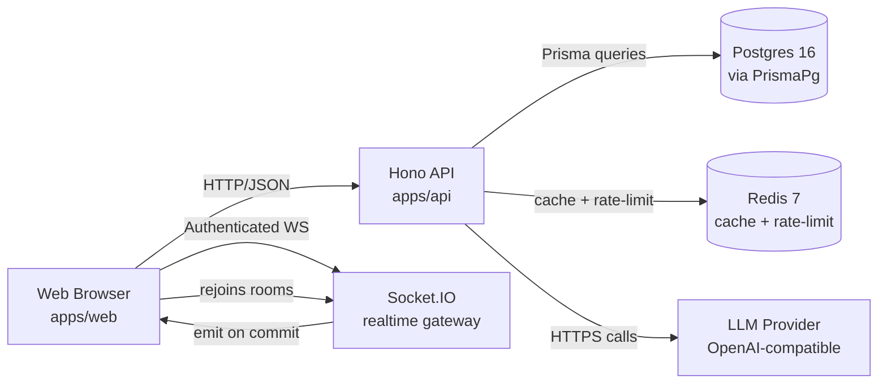

# FlowDesk Documentation Implementation Plan

> **For agentic workers:** REQUIRED SUB-SKILL: Use superpowers:subagent-driven-development (recommended) or superpowers:executing-plans to implement this plan task-by-task. Steps use checkbox (`- [ ]`) syntax for tracking.

**Goal:** Add three flat Markdown docs (`docs/USER.md`, `docs/DEV.md`, `docs/ARCHITECTURE.md`) plus a three-line update under `README.md`'s "Repo layout" so end users and new engineers can onboard without reading session logs.

**Architecture:** Plain Markdown, repo-relative cross-links, one mermaid diagram minimum in `ARCHITECTURE.md`. Each doc stays under 600 lines. No source-code edits, no tooling, no new dependencies.

**Tech Stack:** Markdown. GitHub-rendered. `mermaid` fenced blocks for diagrams only in `ARCHITECTURE.md` (and optionally `DEV.md`).

## Global Constraints

- Files created: `docs/USER.md`, `docs/DEV.md`, `docs/ARCHITECTURE.md`. One file modified: `README.md` (Repo layout block only).
- No `.env` content, no actual secret values, no `sk-…` / `AIza…` / JWT samples. Examples are placeholders (`<your-value>`).
- All Markdown cross-links use repo-relative paths. Every target must already exist at the time of writing.
- Headings start at H1 (one per file), then H2, then H3 only. No skipped levels.
- No images, no badges, no emojis. No bare URLs in body text (wrap in `<…>` or backticks).
- Voice: terse, factual, imperative. Mirrors `AGENTS.md`.
- Length budgets: `USER.md` ≤ 600 lines, `DEV.md` ≤ 500 lines, `ARCHITECTURE.md` ≤ 500 lines.
- Conventional Commit messages. Pre-commit hook will run; docs paths are out of the secret-scanner regex trigger surface.

---

## File Map

| File                                  | Responsibility                                                                                          |
| ------------------------------------- | ------------------------------------------------------------------------------------------------------- |
| `docs/USER.md`                        | End-user help: install, every UI feature, troubleshooting                                              |
| `docs/DEV.md`                         | Dev onboarding: setup, conventions, daily loop, hooks, workflow                                         |
| `docs/ARCHITECTURE.md`                | Cross-cutting architecture: module layout, end-to-end flows, auth, realtime, caching, AI layer, deploy  |
| `README.md`                           | Three new pointers added under existing `## Repo layout` block                                         |

---

## Task 1: `docs/USER.md`

**Files:**
- Create: `docs/USER.md`

**Interfaces:**
- Consumes: nothing
- Produces: a complete user-facing guide; must cross-link `README.md`, `PRD.md`, `RISKS.md`

- [ ] **Step 1: Write the title and purpose block**

Open `docs/USER.md`. Write the following at the top:

```markdown
# FlowDesk User Guide

Self-hosted, AI-augmented task management. This guide covers how to use a running FlowDesk instance. For self-host install/admin, see `README.md`. For engineering, see `docs/DEV.md` and `docs/ARCHITECTURE.md`.

Goals and product context: see `PRD.md`. Known issues: see `RISKS.md`.

## Concepts

- **Workspace** — a tenant. Contains members, boards, labels, tasks.
- **Member** — a user belonging to a workspace. Roles: Owner, Admin, Member, Guest.
- **Board** — a Kanban view of tasks within a workspace, grouped by status.
- **Task** — a unit of work. Has status, priority, due date, assignee, labels, subtasks, dependencies.
- **Status** — workflow state: `BACKLOG`, `TODO`, `IN_PROGRESS`, `IN_REVIEW`, `DONE`, `BLOCKED`.
- **Label** — colored tag attached to a task. 8 named colors. Per workspace.
- **Comment** — thread on a task. Supports `@mention`.
- **Mention** — `@username` inside a comment or task description. Triggers an in-app notification.
- **Dependency** — "A blocks B": B cannot move forward until A is done.
- **Attachment** — file (image, PDF, doc) attached to a task.
- **Notification** — in-app event for mentions, assignments, due-soon.

## Quick Start

1. Install: `docker compose up -d` at the repo root. See `README.md` for env setup.
2. URLs: web `http://localhost:5173`, api `http://localhost:3000`.
3. Seed demo data: `pnpm db:seed`.
4. Login: `demo@flow-desk.app` / `demo1234` (seeded demo account).
5. The `Onboarding Wizard` opens on first login and walks through workspace + first task.
```

- [ ] **Step 2: Append Workspaces + Members**

Add:

```markdown
## Workspaces

Each user can belong to multiple workspaces. The header switcher (`WorkspaceSwitcher`) toggles the active workspace.

### Create a Workspace

1. Avatar menu → **Create workspace**.
2. Name, optional description.
3. You become Owner.

### Invite Members

Workspace settings → **Members** tab → **Invite**. Email field; role select.

### Roles

| Role   | Can do                                                       |
| ------ | ------------------------------------------------------------ |
| Owner  | Everything, including delete workspace and transfer ownership |
| Admin  | Manage members, labels, settings; cannot delete workspace    |
| Member | Create / edit tasks, comments, attachments; manage own tasks  |
| Guest  | Read-only on tasks; can comment if commentable                |

The Owner of `demo@flow-desk.app` workspace is the seeded demo user.
```

- [ ] **Step 3: Append Tasks**

Add:

```markdown
## Tasks

Create a task: board → `+ New Task` → fill title, status, priority, due, assignee, labels, description → save. Editing follows the same modal pattern.

### Status workflow

```
BACKLOG → TODO → IN_PROGRESS → IN_REVIEW → DONE
                            ↘ BLOCKED → IN_PROGRESS
```

Drag a card on the Kanban board to change status. Other connected users see the move via realtime.

### Subtasks

Inside task detail → **Subtasks** → add checklist items. Each subtask has its own status.

### Dependencies

Inside task detail → **Dependencies** → "Add blocker". The task cannot move to `DONE` while a blocker is open. The board marks blocked tasks with a `BLOCKED` badge.

### Priority and Due Date

Priority: `LOW`, `MEDIUM`, `HIGH`, `URGENT`. Due date: ISO date. Overdue tasks appear red in List view.
```

- [ ] **Step 4: Append Views**

Add:

```markdown
## Views

### Kanban

Default board view. Columns are statuses; cards are tasks. Drag cards between columns. Filters in the toolbar: assignee, label, priority, due range.

### List / Table

Toggle via the view switcher. Sortable columns, multi-filter, paginated with cursor (`?cursor=…`). Useful for reporting and bulk edits.
```

- [ ] **Step 5: Append Collaboration**

Add:

```markdown
## Collaboration

### Comments

Task detail → **Comments** → write. Markdown supported. `@username` notifies.

### Mentions

Type `@` then pick a member from the suggestion list. The mentioned member receives a notification in the bell menu and a real-time toast.

### Realtime Presence

The header shows a presence bar with avatars of users currently viewing the same workspace. Disconnects fade out within ~30 seconds (R-24-driven TTL).
```

- [ ] **Step 6: Append Labels + Attachments + Notifications**

Add:

```markdown
## Labels

8 named colors (not free hex). Per workspace.

- Workspace settings → **Labels** → **New label** → name + color.
- Click a task card → label chip → pick or create.

Color names: `red`, `orange`, `yellow`, `green`, `teal`, `blue`, `purple`, `pink`.

## Attachments

Task detail → **Attachments** → drop file or click upload. Preview supported for images, PDFs, and common doc types. Size limit set by `MAX_UPLOAD_SIZE` env (see `README.md`).

## Notifications

Bell icon (header) lists notifications: mentions, assignments, due-soon, etc. Click a notification to deep-link to the task. Real-time toasts appear while a session is active.
```

- [ ] **Step 7: Append AI features**

Add:

```markdown
## AI Features

FlowDesk is wired to an OpenAI-compatible provider. Configure `LLM_BASE_URL` and `LLM_API_KEY` in `.env` (see `README.md`).

- **Assignment suggestion** — AI ranks workspace members by current workload and returns a recommended assignee. One click applies.
- **Auto-schedule** — given priorities, due dates, dependencies, and per-member capacity, AI proposes an ordered schedule. Review before applying.
- **Natural-language task create** — type "Review PR with alex tomorrow high" and AI drafts a structured task.
- **Meeting notes → tasks** — paste meeting notes and AI extracts candidate tasks.

Caveats: the local LLM proxy used in dev is slow (R-24, ~18–27s per call). The UI surfaces a spinner; do not refresh during a call.
```

- [ ] **Step 8: Append Settings + Troubleshooting + footer**

Add:

```markdown
## Settings

- Avatar menu → **Profile** — name, email, avatar.
- Avatar menu → **Change password**.
- Workspace settings — three tabs: **General** (name, description), **Members** (list, roles, invite), **Labels** (CRUD).

## Troubleshooting

| Symptom                                  | Fix                                                                                  |
| ---------------------------------------- | ------------------------------------------------------------------------------------ |
| Cannot log in                             | Reset password via `pnpm db:seed` for demo or run a fresh `POST /api/auth/register`. |
| AI features unresponsive                 | Check `LLM_BASE_URL`, `LLM_API_KEY` in `.env`. Restart api: `pnpm stack:up-build`. |
| Attachment upload stuck                  | Check max size (`MAX_UPLOAD_SIZE`) and free disk in the api container.               |
| Realtime updates delayed / dropped       | Verify redis is up (`pnpm stack:ps`). Disconnect/reconnect by refreshing the page.  |
| Can't see a workspace                    | Ask an Owner or Admin to invite you via the Members tab.                            |
| Workspace switcher is empty              | Your account has no membership. Create or be invited to one.                         |

If nothing here matches, capture the request id from the API response (`X-Request-Id` header) when filing a bug — see `RISKS.md`.
```

- [ ] **Step 9: Final pass — verify length, headings, links**

Run:

```bash
wc -l docs/USER.md
grep -nE '^##? ' docs/USER.md
```

Expected: ≈ 150–200 lines, all H1/H2 only (no H4+), all `(`, `README.md`, `PRD.md`, `RISKS.md` cross-links point at real files.

- [ ] **Step 10: Commit**

```bash
git add docs/USER.md
git commit -m "docs(user): end-user guide"
```

---

## Task 2: `docs/DEV.md`

**Files:**
- Create: `docs/DEV.md`

**Interfaces:**
- Consumes: nothing
- Produces: complete onboarding doc; must cross-link `README.md`, `AGENTS.md`, `claude-progress.md`, `feature_list.json`, `CHANGELOG.md`, `ADR-*`, `RISKS.md`, `session-handoff.md`, `docs/ARCHITECTURE.md`

- [ ] **Step 1: Title + repo map + stack**

Open `docs/DEV.md`. Write:

```markdown
# FlowDesk Developer Guide

For new engineers joining the team. Read once, then keep open as a reference. The full architecture tour is `docs/ARCHITECTURE.md`. Operating instructions for coding agents are in `AGENTS.md`.

## Repo Map

```
apps/web/         # React 18 + Vite + TypeScript + Tailwind v4 + shadcn/ui
apps/api/         # Hono + Node 22 + TypeScript + Prisma 7 + Socket.IO
packages/shared/  # Zod schemas + types shared by web and api
packages/db/      # Generated Prisma client (gitignored output lives at apps/api/generated)
prisma/           # schema.prisma + prisma.config.ts + seed.ts + migrations
docker/           # Dockerfiles + nginx config
scripts/          # dev-local.sh, docker-up.sh, prisma-exec.sh, lefthook installers
docs/             # PRD.md, ADR-*.md, TASKS.md, ACCEPTANCE.md, RISKS.md,
                  # CHANGELOG.md, claude-progress.md, session-handoff.md,
                  # USER.md, DEV.md, ARCHITECTURE.md, superpowers/specs+plans/
e2e/              # Playwright E2E (browser-based)
```

Forging session notes live in `claude-progress.md`. Compact handoffs in `session-handoff.md`. Architecture decisions log: each `ADR-*.md`. Feature state source of truth: `feature_list.json`.

## Stack

Layered architecture. Two halves:

- **Backend (`apps/api`)**: Hono routes → service → repository → Prisma (custom output `apps/api/generated/prisma`). Read `docs/ARCHITECTURE.md` for the layered rationale and `ADR-006-security-middleware-pattern.md` for middleware.
- **Frontend (`apps/web`)**: feature folders under `apps/web/src/features/{feature}/` with `components/`, `hooks/`, `api.ts`, `types.ts`, `index.ts`. Public surface is `index.ts`. Posted data is mutated via TanStack Query, never raw `useEffect` fetches.
```

- [ ] **Step 2: Setup section**

Add:

```markdown
## Setup

```bash
# one-time
./init.sh                       # pnpm install + shared build + lefthook install

# run the stack
cp .env.example .env            # edit: JWT_SECRET, LLM_API_KEY at minimum
pnpm stack:up                   # docker compose up -d (auto-detects port conflicts)
pnpm db:seed                    # 15 users / 6 workspaces / 51 tasks / 199 comments / ...

# verify
curl http://localhost:3000/api/health
open http://localhost:5173      # login: demo@flow-desk.app / demo1234
```

For local dev without docker (host-side postgres + redis bound to `localhost`):

```bash
pnpm install
pnpm dev:local                  # shared tsup --watch + api tsx watch + web vite
```

The standard DB wrapper is `scripts/prisma-exec.sh`. It auto-detects docker-vs-host and rejects invalid `FLOW_DESK_DB_MODE` values (`docker|local`).

```bash
pnpm db:push
pnpm db:migrate
pnpm db:studio                  # http://localhost:5555
pnpm db:reset                   # DESTRUCTIVE — drops + re-pushes schema
pnpm prisma db push --skip-generate   # arbitrary prisma args via wrapper
```
```

- [ ] **Step 3: Daily loop + module layout**

Add:

```markdown
## Daily Development Loop

Hot-reload mode rebinds `apps/api/src` and `packages/shared/src` into the api container. Edits restart within ~1s; no image rebuild.

```bash
pnpm stack:dev-build            # one-time: bake tsx + tsup into api image
pnpm stack:dev                  # up postgres + redis + api
# ... edit files on host ...
pnpm stack:dev-down             # stop the dev stack
pnpm stack:up                   # back to compiled image (no watch)
```

Watch chain: edit `packages/shared/src/**` → `tsup --watch` rebuilds `packages/shared/dist` → api's `tsx watch` (started with `--include='../../packages/shared/dist/**/*.js'`) restarts.

## Module Layout

Backend. `apps/api/src/modules/{feature}/` with one job per file:

- `{feature}.routes.ts` — Hono router + zValidator + per-route rate limit.
- `{feature}.service.ts` — business logic; orchestrates repos, cache, sockets.
- `{feature}.repository.ts` — Prisma only. No logic.
- `{feature}.schema.ts` — Zod schemas for I/O validation.
- `{feature}.types.ts` — TypeScript types/interfaces not in `@flowdesk/shared`.
- `{feature}.test.ts` — colocated unit tests (where useful).

Cross-cutting lives in `apps/api/src/shared/`:

- `middleware/` — auth, rate-limit, request-id, error-handler.
- `lib/` — prisma, redis, jwt, socket, llm-provider, logger, rate-limit-policies.
- `errors/` — typed error classes.

Frontend. `apps/web/src/features/{feature}/`:

- `components/` — feature-specific UI.
- `hooks/` — TanStack Query wrappers (`useQuery` / `useMutation`).
- `api.ts` — type-safe API client (Zod-validated request/response).
- `types.ts` — feature types.
- `index.ts` — public surface; only this file is imported by other features.

App shell primitives live in `apps/web/src/components/ui/` (shadcn-derived). Pages are thin route-level shells; they live in `apps/web/src/pages/`.
```

- [ ] **Step 4: Conventions**

Add:

```markdown
## Conventions

- **Zod everywhere** — every API boundary (`schema.ts`); every FE client response (`api.ts`).
- **Soft delete** — `deletedAt?` on User, Workspace, Task, TaskLabel, TaskLabelAssignment, Comment. Read paths auto-inject `deletedAt: null` via `softDeleteExtension`. Never `DELETE` rows in code; rely on Prisma extension. See `apps/api/src/shared/lib/prisma-extension.ts` and `SOFT_DELETE_MODEL_NAMES`.
- **Caching** — Redis with explicit TTL and an invalidation source-of-truth (the module that mutates owns the invalidation).
- **Auth** — JWT in httpOnly cookie; `assertMembership(workspaceId, userId)` middleware on every workspace-scoped mutation. Cross-workspace access → 401. See `ADR-003-auth-jwt-cookie.md` and `ADR-006-security-middleware-pattern.md`.
- **Pagination** — cursor envelope `{ data, nextCursor }` (see `packages/shared/src/pagination.ts`).
- **Logging** — structured JSON (`logger` in `apps/api/src/shared/lib/logger.ts`) with `requestId` / `userId` / `duration`.
- **No `any`** — see `AGENTS.md` anti-patterns.
- **No business logic in routes or repos** — see `AGENTS.md` anti-patterns.
```

- [ ] **Step 5: Realtime + DB + testing + hooks**

Add:

```markdown
## Realtime

Socket.IO namespaces: `/tasks`, `/notifications`, `/collab`. Auth middleware on `connection`. Rooms by resource: `workspace:{id}` and `task:{id}`. Memory-leak guard: `socket.leave()` in `disconnect`. The implementation spread:

- `apps/api/src/shared/lib/socket.ts` — auth middleware.
- `apps/api/src/modules/realtime/realtime.gateway.ts` — presence gateway (currently mounted on `/tasks`).

Reconnect client uses exponential backoff 1s → 30s with randomization 0.5, timeout 20s. See `apps/web/src/lib/socket.ts` and `ADR-004-realtime-socketio.md`.

## Database (Prisma 7)

- `prisma/schema.prisma` — `provider = "prisma-client"`, custom `output = "../apps/api/generated/prisma"`.
- `prisma.config.ts` at repo root defines the config (`env('DATABASE_URL')`, migrations path, etc.).
- All app code imports the generated client, not `@prisma/client`. The generated dir is gitignored.
- `PrismaPg` driver adapter pattern: `new PrismaClient({ adapter: new PrismaPg({ connectionString }), ... })`.
- Migration file naming: `YYYYMMDDhhmmss_<slug>/migration.sql`.

## Testing

Backend integration tests:

```bash
pnpm --filter @flow-desk/api test:integration
# 142 tests, ~30s
```

Test structure: `apps/api/tests/integration/{feature}.test.ts`. Each module gets its own file. Tests use the soft-delete extension unchanged.

Frontend E2E (Playwright):

```bash
pnpm test:e2e
# requires the docker stack up + a seeded DB
```

Frontend build:

```bash
pnpm --filter @flow-desk/web build
```

## Git Hooks (lefthook)

- `pre-commit` (~15s) — secret scan + per-package TypeScript check for packages that have staged files.
- `pre-push` (~60–90s) — full typecheck + BE integration tests + web build.
- Offline equivalents: `pnpm check:secrets`, `pnpm --filter @flow-desk/<pkg> typecheck`, `pnpm verify`.

See `lefthook.yml` for full config. Bypass (last resort): `git commit --no-verify` / `git push --no-verify`. Never bypass the secret scan.
```

- [ ] **Step 6: Workflow + pitfalls + last block**

Add:

```markdown
## Workflow

1. Pick the highest-priority unfinished item from `feature_list.json`. Set its `status` to `in_progress`. Only one `in_progress` at a time.
2. Read the linked ADR or spec from `docs/superpowers/specs/`.
3. Branch (optional; larger features): `git checkout -b <slug>`.
4. Work in small conventional commits. Hang the patches on the chosen feature.
5. Verify before claiming done: typecheck + tests + (where applicable) `pnpm --filter @flow-desk/web build`.
6. Update `feature_list.json` (status, evidence) and `claude-progress.md` (session log + verified state).
7. Update `RISKS.md` if a new risk surfaced; mirror it back when resolved.

Done = implementation done + verification ran + evidence recorded + `./init.sh` clean.

## Common Pitfalls

- `.env` keys in chat or commit messages → **rotate immediately**. Pre-commit secret scan blocks them in commits. Treat leaks as compromised the moment they reach scrollback.
- Container hostname is `postgres:5432`. Host-side local dev (`pnpm dev:local`) needs `localhost:5432` in `.env`.
- `apps/api/generated/prisma/` is gitignored. If a checkout "loses" Prisma types, run `pnpm prisma generate` first.
- `pnpm` 11 ignores `public-hoist-pattern` in `.npmrc`. Hoist settings live in `pnpm-workspace.yaml`. `prisma` and `@prisma/*` are public-hoisted on purpose for monorepo Docker builds.
- Long-running feature branches accumulate symlinks; `pnpm install --no-frozen-lockfile` clears them.
- `runkit` missing? Use `./scripts/docker-up.sh` — it auto-overrides conflicting host ports.
- `view transitions` and prisma-ESM require Node 22; older toolchains fail silently.
```

- [ ] **Step 7: Final pass — verify length, headings, links**

Run:

```bash
wc -l docs/DEV.md
grep -nE '^###? ' docs/DEV.md
```

Expected: ≈ 180–250 lines, headings only at H1/H2/H3 levels, all cross-linked filenames resolve.

- [ ] **Step 8: Commit**

```bash
git add docs/DEV.md
git commit -m "docs(dev): developer onboarding"
```

---

## Task 3: `docs/ARCHITECTURE.md`

**Files:**
- Create: `docs/ARCHITECTURE.md`

**Interfaces:**
- Consumes: nothing
- Produces: architecture tour with two mermaid diagrams (system overview, realtime namespace/rooms); must cross-link `AGENTS.md`, `ADR-*`, `docs/DEV.md`, `docs/USER.md`, `README.md`

- [ ] **Step 1: Title + system diagram**

Open `docs/ARCHITECTURE.md`. Write:

```markdown
# FlowDesk Architecture

Read once before touching modules. For onboarding, see `docs/DEV.md`. For product context, see `PRD.md`. Decisions are recorded in `ADR-*.md`. Operating rules: `AGENTS.md`. Risks: `RISKS.md`.

## System Overview



Two-way flow: every successful write on `Api` emits a socket event; subscribed browsers patch local state. No polling; no fire-and-forget broadcasts (R-31 mitigation).
```

- [ ] **Step 2: Backend module anatomy**

Add:

```markdown
## Backend Module Anatomy

Every domain follows:

```
apps/api/src/modules/{feature}/
  {feature}.routes.ts      # Hono router + zValidator + per-route rate limit
  {feature}.service.ts     # business logic; orchestrates repo + cache + sockets
  {feature}.repository.ts  # Prisma only; no logic
  {feature}.schema.ts      # Zod schemas for I/O validation
  {feature}.types.ts       # TS types/interfaces (not in @flowdesk/shared)
  {feature}.test.ts        # colocated unit tests (where useful)
```

Rules:

- Routes only wire HTTP. No Prisma, no `assertMembership` (use middleware).
- Services own all logic. They call repos, cache, and sockets; they emit only after a successful commit.
- Repos are thin. They translate Zod-validated input → Prisma queries and return raw rows.
- Schemas are reused on the FE (`packages/shared`). Do not duplicate types drift.

Cross-cutting layer:

```
apps/api/src/shared/
  middleware/auth.ts / rate-limit.ts / error-handler.ts / request-id.ts
  lib/prisma.ts / redis.ts / jwt.ts / socket.ts / llm-provider.ts
      / logger.ts / rate-limit-policies.ts / prisma-extension.ts
  errors/...               # typed error classes
```

Rationale: layered separation matches the Golden Rule in `AGENTS.md`. See `ADR-006-security-middleware-pattern.md` for the middleware composition order.
```

- [ ] **Step 3: Frontend feature anatomy**

Add:

```markdown
## Frontend Feature Anatomy

```
apps/web/src/features/{feature}/
  components/              # feature UI
  hooks/                   # TanStack Query wrappers
  api.ts                   # type-safe client (Zod-validated)
  types.ts                 # feature types
  index.ts                 # public surface (only file imported elsewhere)
```

Cross-cutting:

- `apps/web/src/components/ui/` — primitives from shadcn/ui (dialog, dropdown, popover, tooltip, kanban, …).
- `apps/web/src/lib/` — shared clients: `api`, `queryClient`, `socket`, `auth`, `utils`.
- `apps/web/src/pages/` — route-level shells, mostly composition.

Mutations should use optimistic updates where UX demands it (`TanStack Query`). No raw `useEffect` fetches; the `api.ts` client already enforces Zod on response bodies.
```

- [ ] **Step 4: End-to-end flows (login, task create, drag, mention, AI)**

Add:

```markdown
## End-to-End Flows

### Login

1. `apps/web/src/features/auth/LoginForm.tsx` posts to `/api/auth/login` with email + password.
2. `apps/api/src/modules/auth/auth.routes.ts` validates via `bcrypt` (cost 10).
3. Service issues access + refresh JWT (`apps/api/src/shared/lib/jwt.ts`), writes them as `httpOnly` cookies.
4. Client navigates to `/`. Subsequent API calls carry the cookie automatically.

### Task Create

1. Client opens `NewTaskModal` → on submit, calls `apps/web/src/features/task/api.ts` `createTask(...)`.
2. Handler validates against Zod → POSTs `/api/tasks`.
3. `task.routes.ts` → `zValidator('json', createTaskSchema)` → `task.service.ts#create`.
4. Service runs in a `prisma.$transaction` (Task + initial dependency + label assignments).
5. On success, emits `task:created` on `/tasks` namespace room `workspace:{workspaceId}`.
6. Subscribed clients patch their queries. Presence is unaffected.

### Drag Task across Columns

1. `Kanban` DnD handler builds `updateTaskStatus({ id, status })` mutation.
2. PATCH `/api/tasks/:id` with `{ status }` only.
3. Service repositions in Prisma and emits `task:moved`.
4. The dragged card's `:has-task-moved` flag clears on the broadcast ack.

### @mention in Comment

1. Comment composer emits `createComment({ taskId, body })` on Ctrl+Enter.
2. POST `/api/tasks/:id/comments` → service tokenizes body, finds `@username` matches in workspace members.
3. For each match: create `Notification` row + emit on `/notifications` namespace to user socket.
4. Recipient bell menu updates in real time; toast appears if focus is on the page.

### AI Assignment Suggestion

1. User clicks "AI suggest" on a task.
2. POST `/api/ai/suggest-assignment` → `ai.service.ts` loads per-member workload (`prisma.task.groupBy`) and recent activity.
3. Calls `llm-provider.ts` (configured `LLM_BASE_URL` + `LLM_MODEL`). See `ADR-002-ai-provider.md`.
4. Returns ranked list. UI renders one fallback list alongside the AI ranking; click applies via `PATCH /api/tasks/:id { assigneeId }`. Caveat: dev proxy is slow (R-24).
```

- [ ] **Step 5: Auth + security**

Add:

```markdown
## Auth + Security

Reference: `ADR-003-auth-jwt-cookie.md`, `ADR-006-security-middleware-pattern.md`.

- **JWT in httpOnly cookie.** `SameSite=Lax` blocks third-party XHR. CSRF-safe for a JSON API.
- **bcrypt cost 10.** Was 12 in pre-F1 baseline; reduced for login latency budget (see `claude-progress.md` session 011/012).
- **`assertMembership(workspaceId, userId)`** middleware on every attachment, comment, task, dependency, and AI mutation. Cross-workspace → 401.
- **Rate limits (Redis sliding-window via `rate-limit.ts`):**

| Bucket              | Window | Max  | Scope     |
| ------------------- | ------ | ---- | --------- |
| `auth:register`     | 1h     | 3    | per IP    |
| `auth:login`        | 1min   | 5    | per IP    |
| `auth:refresh`      | 1min   | 30   | per IP    |
| AI routes           | 1min   | 5    | per user  |
| `/api/*` writes     | 1min   | 60   | per user  |

Every response sets `X-RateLimit-*`; `429` includes `Retry-After`. Suite config: `apps/api/src/shared/lib/rate-limit-policies.ts`.

- **Socket auth.** Middleware on `connection` verifies the access token from the cookie or `auth.token`. Failure → `unauthorized` event + `socket.disconnect(true)`. Implementation: `apps/api/src/shared/lib/socket.ts`.
```

- [ ] **Step 6: Realtime**

Add:

```markdown
## Realtime

Reference: `ADR-004-realtime-socketio.md`.

```mermaid
flowchart LR
  subgraph Client
    B1[Browser A]
    B2[Browser B]
  end
  subgraph Namespaces
    T[/tasks/]
    N[/notifications/]
    C[/collab/]
  end
  subgraph Rooms
    W[workspace:{wid}]
    K[task:{tid}]
    P[presence:{wid}]
  end

  B1 -- subscribe --> T
  B2 -- subscribe --> T
  T --> W
  T --> K
  B1 -- presence:join --> T --> P
  B1 -- subscribe notifications --> N
  B1 -- cursor updates --> C
```

Rules:

- Namespaces by domain (`/tasks`, `/notifications`, `/collab`).
- Rooms by resource (`workspace:{id}` for global broadcast, `task:{id}` for narrow).
- `socket.leave()` in `disconnect` to avoid room leaks.
- **Presence gateway:** `apps/api/src/modules/realtime/realtime.gateway.ts`. Backed by Redis hash `presence:{wid}`, 30s TTL, 10s sweeper. Broadcast on every change.
- Client reconnect: exponential backoff 1s → 30s, randomization 0.5, timeout 20s.
```

- [ ] **Step 7: Data model snapshot**

Add:

```markdown
## Data Model Snapshot

Models in `prisma/schema.prisma`. Every model carries `id` (cuid), `createdAt`, `updatedAt`. Soft-delete models (User, Workspace, Task, TaskLabel, TaskLabelAssignment, Comment) also carry `deletedAt?`. Indexes on every FK and common filter. Uniqueness constraints where business logic demands it.

- **User** — account; bcrypt password hash; optional Google `providerId`.
- **Workspace** — tenant; name + slug.
- **Membership** — `userId × workspaceId × role` (Owner/Admin/Member/Guest). Unique.
- **Task** — the work item. `status`, `priority`, `assigneeId`, `reporterId`, `dueDate`. Subtasks live in `TaskSubtask`; blockers/blocks in `TaskDependency`.
- **TaskLabel** — per-workspace; `name` + named-enum `color` (8 values).
- **TaskLabelAssignment** — `task × label` join.
- **Comment** — `taskId` + `authorId` + `body`.
- **Attachment** — `taskId` + `uploadedById` + `size` + `type` + storage pointer.
- **Notification** — `recipientId` + `kind` (`TASK_MENTIONED`, `TASK_DUE_SOON`, …)+ payload.

See `prisma/schema.prisma` for the source of truth.
```

- [ ] **Step 8: Caching + AI + Deploy**

Add:

```markdown
## Caching

Per-resource Redis keys with explicit TTL:

- `workspace:{wid}` — 5–15 min; invalidated on workspace mutation.
- `task:{tid}` — 30s; invalidated on `task.service.ts` commit.
- `labels:{wid}` — 60s; invalidated on label service mutation.
- `presence:{wid}` — see Realtime section.

Convention: the service that mutates owns the invalidation. No global TTL bumps.

## AI Layer

- `apps/api/src/shared/lib/llm-provider.ts` — single seam. Configured by `LLM_BASE_URL`, `LLM_API_KEY`, `LLM_MODEL`.
- 30s `AbortController` timeout. 1 retry on 5xx. Errors map to `LLMError` → 502 with `code: LLM_UPSTREAM`.
- Caching off by default; let the upstream provider cache if it wants.
- See `ADR-002-ai-provider.md`.

## Build + Deploy

```bash
pnpm stack:up                 # production-like compose up
pnpm stack:up-build           # idempotent image rebuild
pnpm stack:down
pnpm stack:logs
pnpm stack:ps
```

Healthcheck: `GET /api/health` → 200. Seed: `pnpm db:seed`. Demo login: `demo@flow-desk.app` / `demo1234`.
```

- [ ] **Step 9: Sharp edges + cross-refs**

Add:

```markdown
## Sharp Edges

- **R-24 — LLM latency UX.** Local proxy provider is slow (~18–27s/call). Surface spinners; do not block the UI.
- **Prisma custom output.** `apps/api/generated/prisma/` is gitignored. Always import from there. Never publish a `@prisma/client` import in `apps/api/src/`.
- **Seed ESM/CJS.** Prisma 7 client uses `import.meta.url`. `scripts/prisma-exec.sh` builds the seed as ESM with a `require` shim banner.
- **Node 22 only.** Earlier toolchains silently fail on `view transitions` and Prisma 7 ESM.
- **pnpm 11 + monorepo Docker.** Hoist settings live in `pnpm-workspace.yaml`, not `.npmrc`. See `claude-progress.md` session 014.
- **Lefthook secret scan.** Never bypass on commits that touch code or env. Re-run with `pnpm check:secrets`.

## Cross-References

- `README.md` — install + quick start
- `docs/USER.md` — end-user guide
- `docs/DEV.md` — developer onboarding
- `PRD.md` — product requirements
- `AGENTS.md` — operating rules for coding agents
- `ADR-001-monorepo.md` → `ADR-006-security-middleware-pattern.md`
- `RISKS.md` — risk register
- `claude-progress.md` — session log
- `feature_list.json` — feature state
- `CHANGELOG.md` — public change log
```

- [ ] **Step 10: Final pass**

Run:

```bash
wc -l docs/ARCHITECTURE.md
grep -nE '^```mermaid' docs/ARCHITECTURE.md
```

Expected: ≥ 2 `mermaid` blocks, ≈ 200–260 lines, headings only H1/H2/H3.

- [ ] **Step 11: Commit**

```bash
git add docs/ARCHITECTURE.md
git commit -m "docs(arch): system + module architecture deep-dive"
```

---

## Task 4: Update `README.md` to point at the three docs

**Files:**
- Modify: `README.md:115-126` (the "Repo layout" block under `## Repo layout`)

**Interfaces:**
- Consumes: existing `## Repo layout` block in `README.md`
- Produces: extended layout block listing the three new docs

- [ ] **Step 1: Verify exact text of the block**

Run:

```bash
sed -n '110,130p' README.md
```

Expected:

```
## Repo layout

```
apps/web/        # React + Vite
```

- [ ] **Step 2: Add three lines right before the code fence closing line**

Use `edit` with the following old/new pair so the insertion is exact and idempotent:

```
old:
apps/web/        # React + Vite
apps/api/        # Hono + Prisma
packages/shared/ # Zod schemas + types
prisma/          # schema.prisma + seed.ts
docker/          # Dockerfiles + nginx config
scripts/         # dev-local.sh (no Docker) + docker-up.sh (smart compose)
PRD.md           # Product requirements
ADR-*.md         # Architecture decisions (001..006)
TASKS.md         # Sprint backlog
ACCEPTANCE.md    # Testable acceptance criteria
RISKS.md         # Risk register
AGENTS.md        # Agent operating instructions
```

```
new:
docs/USER.md         # End-user guide (install + features + how-to)
docs/DEV.md          # Developer onboarding
docs/ARCHITECTURE.md # Architecture deep-dive (read once before editing a module)
apps/web/        # React + Vite
apps/api/        # Hono + Prisma
packages/shared/ # Zod schemas + types
prisma/          # schema.prisma + seed.ts
docker/          # Dockerfiles + nginx config
scripts/         # dev-local.sh (no Docker) + docker-up.sh (smart compose)
PRD.md           # Product requirements
ADR-*.md         # Architecture decisions (001..006)
TASKS.md         # Sprint backlog
ACCEPTANCE.md    # Testable acceptance criteria
RISKS.md         # Risk register
AGENTS.md        # Agent operating instructions
```

- [ ] **Step 3: Verify the diff is exactly three lines**

Run:

```bash
git diff README.md
```

Expected: only the three-line addition at the `## Repo layout` block; no other lines touched.

- [ ] **Step 4: Sanity — `pnpm --filter @flow-desk/web build` still passes without touching source**

This is a sanity check that nothing else relies on the README layout:

```bash
pnpm --filter @flow-desk/web typecheck
pnpm --filter @flow-desk/api typecheck
```

Expected: exit 0 for both. (Docs change does not affect either; cheap insurance.)

- [ ] **Step 5: Commit**

```bash
git add README.md
git commit -m "docs(readme): cross-link user + dev + architecture docs"
```

---

## Self-Review Checks

Before final approval:

- Spec coverage: every section in the spec (`docs/USER.md` 13 sections, `docs/DEV.md` 13 sections, `docs/ARCHITECTURE.md` 12 sections, README pointer) maps to one step in this plan. README pointer = Task 4.
- No placeholders: every step either ships exact content or describes a verification (`grep`, `wc`, `pnpm typecheck`).
- ID consistency: file names (`docs/USER.md`, `docs/DEV.md`, `docs/ARCHITECTURE.md`), ADR filenames (`ADR-001`..`ADR-006`), module paths (`apps/api/src/modules/{feature}/...`, `apps/web/src/features/{feature}/...`) match the actual tree (verified against `apps/api/src/modules/*` and `apps/web/src/features/*` listings).
- All cross-referenced files in the new docs exist: `README.md`, `PRD.md`, `AGENTS.md`, `RISKS.md`, `CHANGELOG.md`, `ADR-001-monorepo.md`..`ADR-006-security-middleware-pattern.md`, `claude-progress.md`, `session-handoff.md`, `feature_list.json`, `lefthook.yml`, `docs/USER.md` (self), `docs/DEV.md` (self), `docs/ARCHITECTURE.md` (self).
- Mermaid minimum: Task 3 ships two diagrams (system overview + realtime namespaces).
- No code or config edits. Only Markdown + README pointer.

## Done

After Task 4 + its verification:

```bash
git log --oneline -10
ls -la docs/USER.md docs/DEV.md docs/ARCHITECTURE.md README.md
```

Expected: four new commits at the top, all four files present.
